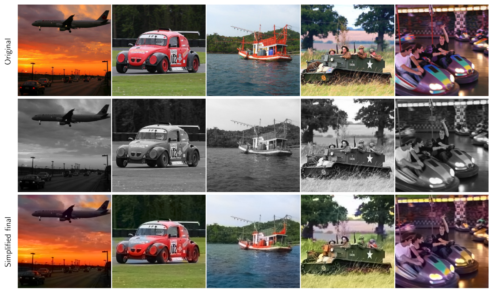
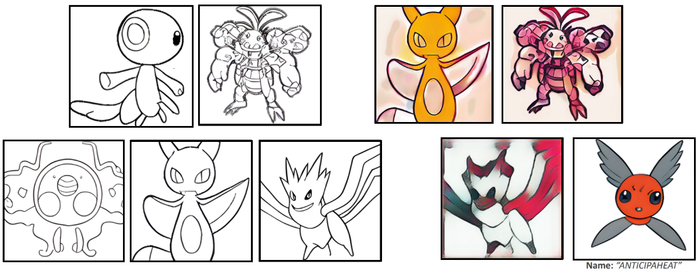
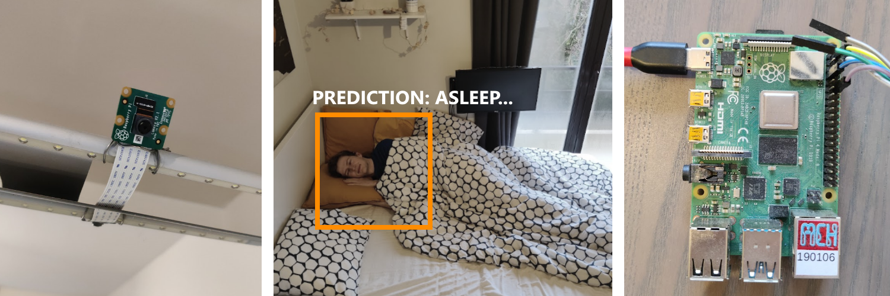
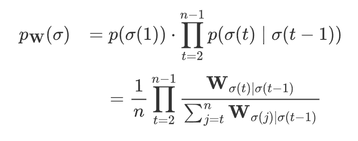
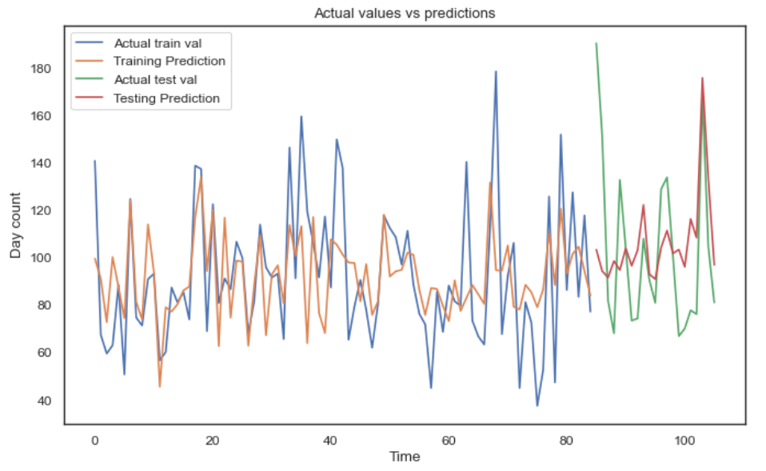

## About
I am a Researcher in the field of Integrated sensing and communication at imec Beglium. I have interdisciplinary expertise in signal processing, communication, and deep learning.

## Education
- Ph.D., Integrated communication and Sensing *(Ongoing)* |
- M.S., Communications and Computer Networks at Poltecnico di Torino, Italy *(Gpa: 110/110)* |
- B.S., Electronics and Communication Engineering at NIT Srinagar, India  |

&nbsp;

## Work Experience

### (1) Researcher @ imec (2022 - Ongoing)
- Research in **integrated sensing and communication**, focusing on **mmWave COTS sensing** for **interactive extended reality applications**. 
- Teaching the lab sessions for **Network Architecture** course at the University of Antwerp.

### (2) Research Analyst at Sagacious IP India (2018-2019)
- Patent Analyst at Sagacious IP India. Helping clients manage their novel assets and ideas by conducting novelty and invalidity searches.

[Publication](https://arxiv.org/abs/2408.12936), [GitHub](https://github.com/fdenoodt/Smooth-InfoMax)

### (2) Image colorization - Paper implementation
- For a school group assignment, 2 fellow students and I implemented an image colorization model using PyTorch, based on the paper "Colorful Image Colorization" by Richard Zhang, Phillip Isola, and Alexei A. Efros. The paper proposes a method for converting grayscale images to color using an autoencoder-based Neural Network.

- The images below show some of our results; **row 1:** ground truth images, **row 2:** grayscale images serving as input, and **row 3:** model predictions. It seems to work quite well.

	

[Report](https://github.com/WardGauderis/Image-Colourisation/blob/main/report.pdf), [GitHub](https://github.com/WardGauderis/Image-Colourisation)

### (3) Pokémon Generator based on Transfer Learning

- For a computational creativity assignment, I **generated fake Pokémon images using the open-source text-to-image model** ruDALLE. I fine-tuned the model on images of a specific Pokémon type and also used the pretrained weights to generate outlines of Pokémon sketches. 
- The **generation of the names** was also automated; the creative system took a few input words, made some **permutations**, and selected the best permutation, **evaluated using a linear classifier trained on Pokémon names**. The linear classifier then ranked the generated names and selected the most plausible option.

	

[Report](./pokemon_character_design.pdf)

### (4) Image recognition alarm
- Because waking up can be hard, I made a smart alarm to help me out. The alarm contains a camera that is pointed at my bed and detects when I sleep. When it is time to wake up, the alarm continues to play music while I stay in bed. Only when I walk out of bed, the alarm will stop. 
- The alarm consists of a Raspberry Pi, a camera, and speakers. Classification is done using a **Convolutional Neural Network** developed in **Python** with **Keras**. The front end is developed in Angular.  

	

[GitHub](https://github.com/oBoii/alarm)

### (5) Two genetic algorithms for solving the Traveling Salesmen Problem 
- The methods consist of **a conventional selection-mutation-crossover approach** and a more **research-oriented approach** based on gradient-descent-based for discrete domains. The second is done by extending the Plackett-Luce model with a new probability representation, defined as a first-order Markov chain, as shown below:

- While the equations may look fancy, it doesn't really work that well in practice (that's the downside of building upon less-established methods I guess 😅).

[Report](https://github.com/fdenoodt/evolution-assignment-2023-indiv/blob/main/text_indiv/r0698535_final.pdf), [GitHub](https://github.com/fdenoodt/evolution-assignment-2023-indiv)

### (6) Kaggle competition - Appliances regression
- **Problem statement**: To forecast the energy consumption of appliances in a house at a given time.
- My proposed solution consisted of different regression models, including **linear regression**, **decision trees**, **boosting regression**, and **support vector regression**. I also went through the full machine learning pipeline, including data visualization, data preprocessing, cross-validation for time series data, feature engineering, and model training with parameter tuning.
- I ranked within the top **10% of the leaderboard**. 

	

[GitHub](https://github.com/fdenoodt/machine-learning-challenge/blob/master/PROJECT.ipynb)



